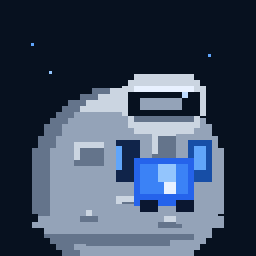

# Astronaut Term

A tiny pixel astronaut for your AI coding terminal.

Works with:

- Claude Code
- OpenAI Codex



| Host | Companion |
| --- | --- |
| Claude Code | Astronaut Mod above the prompt |
| Codex | Native Astronaut Pet selected with `/pets` |

## Install

```bash
npx ai-plugin-astronaut-term
```

This package is ready for that command once published to npm. From a checkout, run `node bin/install.js install`. The installer detects both CLIs and installs only the adapters it finds. It uses Codex V1 for current Codex CLI compatibility and installs the Claude mod from a local marketplace. Existing unrelated pet or marketplace directories are left alone.

Codex:

```text
/pets
```

Choose **Astronaut Term**. To add the optional Codex skill/plugin, install the package in `codex/` through your Codex plugin marketplace.

Claude Code loads the mod on the next session. Configure speed, sleep, HUD, status text, satellites, and scene under `/plugin` → Installed → Astronaut Term → Configure options.

## Commands

```bash
npx ai-plugin-astronaut-term install
npx ai-plugin-astronaut-term doctor
npx ai-plugin-astronaut-term uninstall
```

## Preview and development

```bash
npm run preview
npm run demo
```

`preview` regenerates the state images and transparent Codex V1/V2 atlases. `demo` also creates `preview/mission.gif` with the idle → thinking → working → success sequence. The preview builder requires Python 3 and the system `libwebp` library. Claude Code mods require Claude Code 2.1.287 or newer; develop locally with `claude --plugin-dir ./claude`.

No runtime network calls, telemetry, prompts, file names, or command arguments are sent anywhere. The Claude mod only uses local tool names and lifecycle state for its animation.
